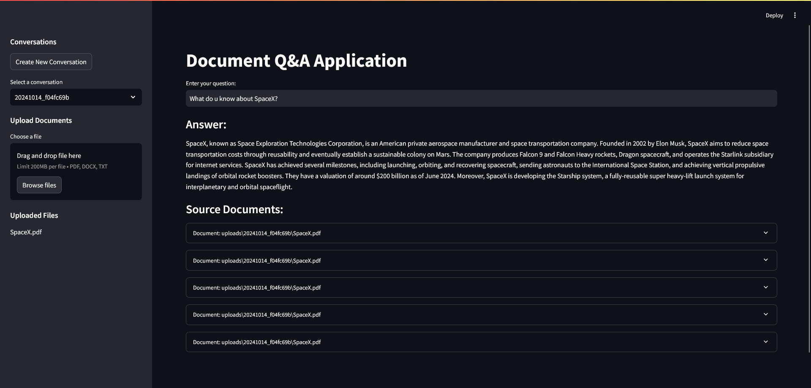
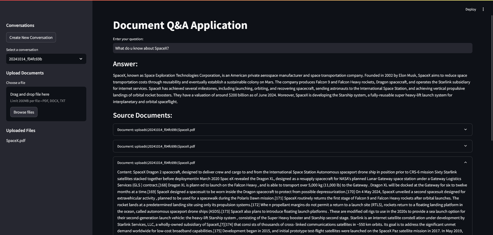

# Document Q&A Application

## About the Project

This project is a Document Q&A Application that allows users to upload various types of documents (PDF, DOCX, TXT, CSV, XLSX, MD), process them, and then ask questions about the content. The application uses advanced natural language processing techniques to provide accurate answers based on the uploaded documents.




## Detailed Explanation

The application consists of several key components:

1. **Document Loaders**: The project supports multiple file types through various document loaders (PDF, DOCX, CSV, XLSX, Markdown, TXT). These loaders are responsible for extracting text content from the uploaded files.

2. **Text Splitting**: After loading, the documents are split into smaller chunks to facilitate efficient processing and retrieval.

3. **Vector Store**: The processed text chunks are embedded and stored in a Pinecone vector database, allowing for quick and efficient similarity searches.

4. **QA Chain**: The application uses a question-answering chain powered by OpenAI's language model to generate responses based on the retrieved context.

5. **Web Interface**: A Streamlit-based web interface allows users to interact with the application, upload documents, and ask questions.

6. **Conversation Management**: Users can create and switch between different conversations, with each conversation having its own set of uploaded documents and question history.

## Installation

To set up the Document Q&A Application, follow these steps:

1. Clone the repository:
   ```
   git clone https://github.com/vstorm-co/opensource-rag.git
   ```

2. Create a virtual environment and activate it:
   ```
   python -m venv venv
   source venv/bin/activate  # On Windows, use `venv\Scripts\activate`
   ```

3. Install the required dependencies:
   ```
   pip install -r requirements.txt
   ```

4. Set up environment variables:
   Create a `.env` file in the project root and add the following variables:
   ```
   PINECONE_API_KEY=your_pinecone_api_key
   PINECONE_INDEX_NAME=your_pinecone_index_name
   OPENAI_API_KEY=your_openai_api_key
   ```

5. Initialize the SQLite database:
   ```
   python -c "from database import init_db; init_db()"
   ```

6. Run the Streamlit application:
   ```
   streamlit run main.py
   ```

## Usage

1. Start the application by running `streamlit run main.py`.
2. Create a new conversation or select an existing one from the sidebar.
3. Upload documents using the file uploader in the sidebar.
4. Once documents are processed, enter your question in the main area.
5. The application will display the answer along with relevant source documents.

## Contributing

Contributions to the project are welcome. Please fork the repository and submit a pull request with your proposed changes.
